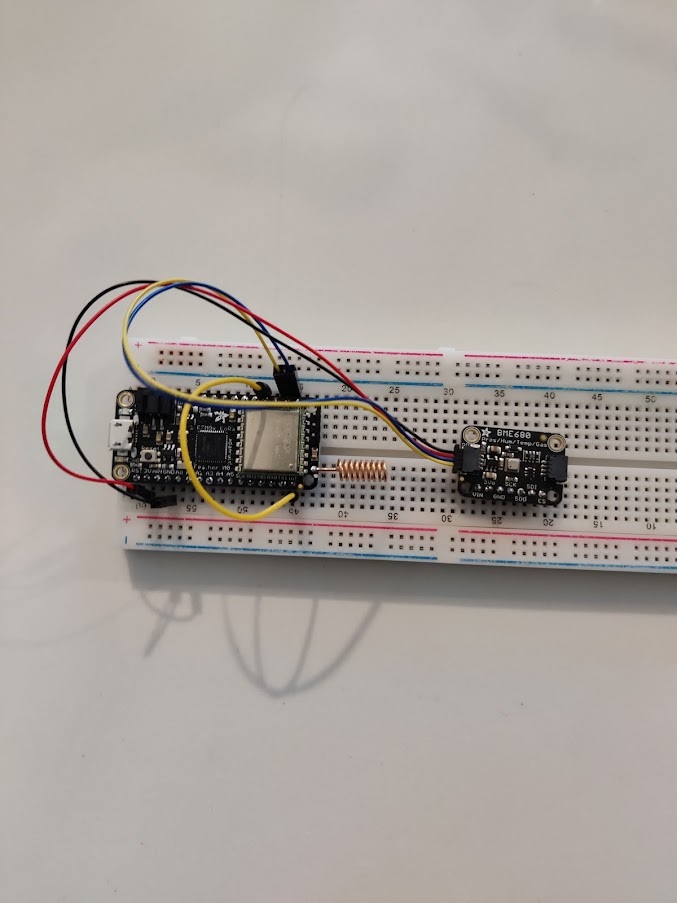

# LoRaWAN-Independent-Study
Jim Horwitz

Fall 2021 Semester

Advised by Nick Barendt, ISSACS

## Hardware Setup

Hardware used was an Adafruit Feather M0 with 900 MHz radio https://www.adafruit.com/product/3178 and Adafruit's BME680 temperature, humidity, altitude, and pressure sensor https://www.adafruit.com/product/3660

Here is a picture of the hardware setup:

Connections:

**Jumper io1 to Pin 6.** This is required for the callback function to work. Its unclear why, but when you remove the jumper, the callback function of the SendBuffer method is never called.

**Solder Pigtail Antenna to ant pin** Requied for the radio to work. Can also use three SMD pads for an external antenna at the bottom of the board.

**Use stemma wires from BME680 to I2C Pins of Feather** Required for communication between the feather and the BME680 board.

For further instrucions, follow Helium's getting started with the Feather M0 guide: https://docs.helium.com/use-the-network/devices/development/adafruit/adafruit-feather-m0-rfm95/arduino/ I don't recommend following the guide after the hardware section - the library they use is deprecated.

## Software Setup
**Note: I didn't like the LoRaWAN library Helium recommended to use in their getting started guide. It was also deprecated, so I decided to use the Arduino LoRaWAN wrapper library (https://github.com/mcci-catena/arduino-lorawan#overview). Their readme is very informative and I highly recommend following it.
 
**Install the following packages through the arduino package manager:**

(Of course, if newer versions come out feel free to use them, but you may run the risk of the provided code in this repo not working)

| Title                        | Author      | Version |
|------------------------------|-------------|---------|
| MCCI Arduino LoRaWAN Library | Terry Moore | 0.9.1   |
| MCCI LoRaWAN LMIC Library    | Terry Moore | 4.0.0   |
| CayenneLPP                   |Electronic Cats| 1.3.0 |
| Adafruit BME680 Library      | Adafruit    | 2.0.1   |
| Catena-mcciadk*              | Terry Moore | 0.2.2   |

*The Catena-mcciadk package may have to be installed manually through the github repo here: https://github.com/mcci-catena/Catena-mcciadk

### Miscellaneous Notes

#### Precompiler Flags
To get the feather working with the Helium Network, you have to define two precompiler flags:
    
    #define ARDUINO_LMIC_CFG_NETWORK_HELIUM 1
    #define ARDUINO_LMIC_CFG_SUBBAND -1

The final product of this independent study can be found in the Final-Environmental-Sensor folder. The file has three main objects:
- The LoRaWAN Object
  - Handles all the radio work for LoRaWAN.
- The Sensor Object
  - handles reading from the BME680 sensor and calling the sendBuffer method of the LoRaWAN object to send out the package.
- The Log Object
  - I'm still unsure what the log object is used for, it was included from the original example file I based it off of. My best educated guess is that the log object handles debugging, and when errors occur, pastes them into a log file on the communicated computer via the Serial line. I tried deleting all instances of the log to see if I could get by, but it broke everything.

To encorporate CayenneLPP into the project, the library only lets you input digits that are rounded a very specific way. For more info, check out the CayenneLPP API (https://github.com/ElectronicCats/CayenneLPP/blob/master/API.md).

 ## Additional Resources

 Feather M0

 https://docs.helium.com/use-the-network/devices/development/adafruit/adafruit-feather-m0-rfm95/arduino/

 https://docs.helium.com/use-the-network/devices/development/adafruit/adafruit-feather-m0-rfm95/

 https://learn.adafruit.com/adafruit-feather-m0-radio-with-lora-radio-module/using-the-rfm-9x-radio

CayenneLPP

 https://www.thethingsindustries.com/docs/integrations/payload-formatters/cayenne/

 https://www.thethingsnetwork.org/docs/devices-and-gateways/arduino/api/cayennelpp/

https://github.com/ElectronicCats/CayenneLPP

https://github.com/ElectronicCats/CayenneLPP/blob/master/API.md 